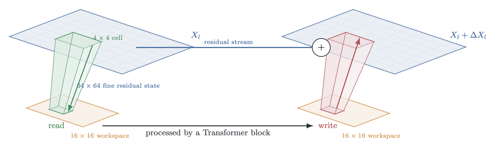
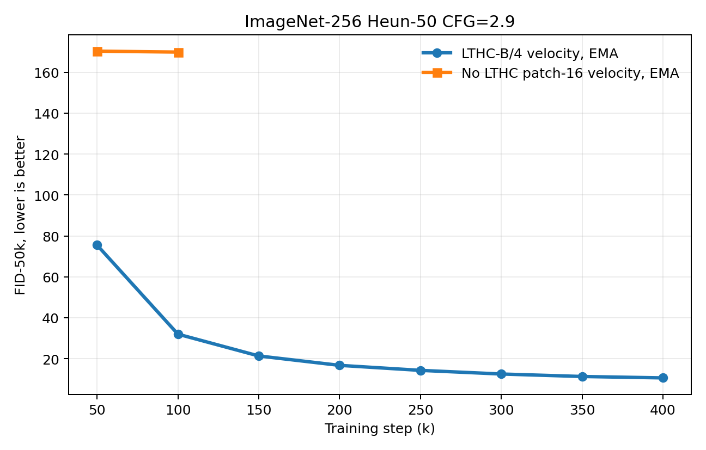
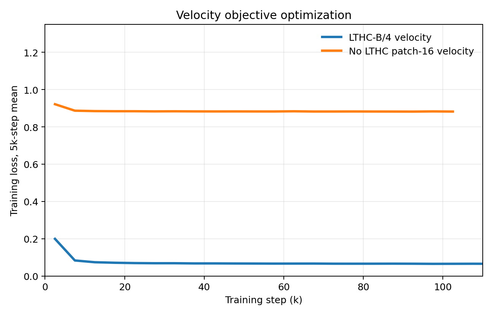

# FlowMatching-LTHC

FlowMatching-LTHC is a flow-matching diffusion backbone built around **Local Token Hyper-Connections**. It keeps a high-resolution residual stream for local image detail, while running the expensive global Transformer computation on a much smaller workspace.

The released checkpoint is a class-conditional ImageNet-256 velocity model. ImageNet is the reference experiment, not a hard assumption of the architecture.



## Core Idea

A direct patch-4 Transformer on 256x256 images has `64 x 64 = 4096` image tokens, making global attention expensive. A patch-16 Transformer has only `16 x 16 = 256` tokens, but it throws away the high-resolution residual interface that patch-4 models can use to preserve local structure.

LTHC separates these roles:

```text
high-resolution residual state: 64 x 64 local tokens
low-resolution global workspace: 16 x 16 tokens
```

Each block performs a read-transform-write update:

1. **Read:** a local `4 x 4` high-resolution cell is pooled into one workspace token, channel by channel.
2. **Transform:** a standard JiT-style Transformer block processes the `16 x 16` workspace.
3. **Write:** the workspace update is projected back into the corresponding high-resolution cell and added to the residual stream.

The Transformer never attends over all 4096 high-resolution tokens. It attends over the 256 workspace tokens, while the high-resolution stream remains available as the persistent residual state.

The workspace branch keeps the usual modern DiT/JiT components:

- RMSNorm and AdaLN gates
- QK RMSNorm attention
- RoPE on the workspace grid
- SwiGLU channel MLP
- class and time conditioning through AdaLN

There are no class/time/register prefix tokens in the released model.

## Architecture

Let $X_l$ be the high-resolution residual state at layer `l`, and let $Z_l$ be the low-resolution workspace. In cell notation,

```text
X_l: [B, 16*16, 4*4, C]
Z_l: [B, 16*16, C]
```

where each workspace token corresponds to one `4 x 4` cell in the high-resolution grid.

A generic LTHC block is:

$$
Z_l = R_l(X_l)
$$

$$
\Delta Z_l = F_l(Z_l, c)
$$

$$
X_{l+1} = X_l + P_l(\Delta Z_l)
$$

Here:

- $R_l$ is the local read from the high-resolution residual stream to the workspace.
- $F_l$ is the Transformer block that runs on workspace tokens.
- $P_l$ is the local write from workspace updates back to the residual stream.
- $c$ is the time-plus-class conditioning vector.

The local read and write are channel-wise maps inside each cell:

```text
read:  weighted 4x4 pooling, one set of weights per channel
write: channel-wise broadcast back into the same 4x4 cell
```

The released model uses a **shared read** operator, $R_l = R$, and layer-specific write operators, $P_l$. Because $R$ is shared and the local maps are linear, the workspace state can be advanced exactly without materializing the full high-resolution residual stream after every block:

$$
Z_{l+1} = Z_l + \Gamma_l \Delta Z_l
$$

After all 12 blocks, the high-resolution state is materialized once before the patch decoder:

$$
X_L = X_0 + \sum_l P_l(\Delta Z_l)
$$

This shared-read design is both an architectural choice and a system optimization. It gives the model a stable workspace coordinate across depth, while avoiding repeated high-resolution memory traffic in the main block loop.

## Released Model

Public alias:

```text
lthc_b4_velocity
```

Current internal name:

```text
local_thc_jit_shared_read_fused_final12_shared_adaln_b4
```

Legacy checkpoint alias, still accepted by `build_model()`:

```text
local_thc_jit_shared_write_fused_final12_shared_adaln_b4
```

The legacy alias came from an early reversed read/write naming convention. In this repository, `read` always means high-resolution residual to workspace, and `write` means workspace update back to the residual stream.

Configuration summary:

| field | value |
|---|---:|
| image size | 256 |
| high-res patch size | 4 |
| high-res grid | 64 x 64 |
| workspace grid | 16 x 16 |
| hidden size | 768 |
| depth | 12 |
| heads | 12 |
| patch embed | Conv patchify 3 -> 128, then 1x1 Conv 128 -> 768 |
| objective | velocity prediction |
| sampler | Heun, 50 steps, CFG |

## Compute Snapshot

The table below counts one multiply-add as two FLOPs. The estimates include
patch embedding, attention projections, attention matrix products, SwiGLU MLPs,
the LTHC read/write interface, and the final patch decoder. Norms, activations,
softmax scalar overhead, and classifier-free guidance doubling at sampling time
are not included.

| model | params | global attention tokens | high-res residual tokens | approx GFLOPs / forward | note |
|---|---:|---:|---:|---:|---|
| LTHC-B/4 velocity | 91.63M | 256 | 4096 | 47.15 | released model |
| direct patch-16 shared-AdaLN JiT-B | 92.32M | 256 | none | 46.31 | low-res baseline |
| direct patch-4 shared-AdaLN JiT-B | 94.62M | 4096 | none | 1315.42 | full patch-4 attention reference |
| direct patch-16 standard AdaLN JiT-B | ~131.30M | 256 | none | ~46.31 | per-block AdaLN parameter reference |

The released model uses PixelArt-style **shared AdaLN** rather than standard
per-block AdaLN-Zero. For `C=768` and `depth=12`, a per-block `C -> 6C`
AdaLN modulation stack would use about `42.5M` block-modulation parameters.
The shared-AdaLN version uses one such modulation head, about `3.54M`
parameters, plus a shared final modulation head. This saves about `39M`
parameters without changing the workspace Transformer FLOPs materially.

The LTHC interface itself is small: one shared channel-wise read and twelve
layer-specific channel-wise writes add only about `0.16M` parameters. The
point of LTHC is therefore not parameter scaling; it is keeping a patch-4
high-resolution residual state while running global communication on a
patch-16-sized workspace.

## Triton Fast Path

The lazy workspace recurrence removes most per-layer high-resolution traffic. The remaining expensive step is final materialization:

$$
X_L = X_0 + \sum_l P_l(\Delta Z_l)
$$

A naive PyTorch implementation would create one broadcasted high-resolution update per layer. The released fast path uses a fixed-shape Triton kernel for the B/4, depth-12 case that fuses all 12 write-back operations and the residual add into one high-resolution pass.

See [docs/kernel_note.md](docs/kernel_note.md) and [flowmatching_lthc/models/kernel_note.md](flowmatching_lthc/models/kernel_note.md) for implementation details.

## Reference Results

Reference run:

```text
im256_local_thc_shared_write_fused_final12_b4_velocity_gpus4567_bs128_accum2_20260531_055810
```

The run directory keeps its original legacy name; the architecture is the shared-read model described above.

50k-sample ImageNet validation metrics, EMA checkpoint, Heun 50, CFG 2.9:

| step | EMA FID-50k | EMA IS |
|---:|---:|---:|
| 50k | 75.49 | 20.46 |
| 100k | 31.99 | 51.85 |
| 150k | 21.34 | 75.10 |
| 200k | 16.75 | 91.75 |
| 250k | 14.30 | 104.53 |
| 300k | 12.52 | 114.42 |
| 350k | 11.31 | 122.80 |
| 400k | 10.63 | 127.59 |



The important ablation is direct patch-16 velocity prediction without the LTHC high-resolution residual interface. It uses the same velocity objective and a comparable shared-AdaLN workspace Transformer, but directly processes 16x16 patch tokens. We only trained this baseline to 100k because it was already clearly failing: EMA FID-50k stayed around 170 and the training loss barely moved.

| model | step | EMA FID-50k | EMA IS | training loss |
|---|---:|---:|---:|---:|
| LTHC-B/4 velocity | 100k | 31.99 | 51.85 | 0.064 |
| No-LTHC patch-16 velocity | 100k | 169.80 | 6.83 | 0.881 |



The compact CSV/plot snapshot is stored in `results/lthc_patch4_ema50k/`.

## Installation

```bash
git clone https://github.com/tongtongliang/flowmatching_lthc.git
cd flowmatching_lthc
pip install -e .
```

Core dependencies are listed in `pyproject.toml`. The CUDA fast path expects PyTorch 2.x and Triton.

## Checkpoint

The 400k EMA checkpoint is published as a GitHub Release asset rather than committed to git, because the file is about 1.4GB.

Expected filename:

```text
step_00400000.pt
```

Download:

```bash
mkdir -p checkpoints
wget -O checkpoints/step_00400000.pt \
  https://github.com/tongtongliang/flowmatching_lthc/releases/download/v0.1.0/step_00400000.pt
```

After downloading, set:

```bash
export FLOWMATCHING_LTHC_CKPT=/path/to/step_00400000.pt
```

## Inference

Minimal generation command:

```bash
python scripts/inference.py \
  --checkpoint "$FLOWMATCHING_LTHC_CKPT" \
  --output outputs/lthc_grid.png \
  --class_id 207 \
  --batch_size 16 \
  --steps 50 \
  --cfg 2.9 \
  --compile
```

Multiple classes:

```bash
python scripts/inference.py \
  --checkpoint "$FLOWMATCHING_LTHC_CKPT" \
  --output outputs/lthc_multi_class.png \
  --class_ids 207 281 285 292 \
  --batch_size 16 \
  --steps 50 \
  --cfg 2.9 \
  --compile
```

CPU checkpoint-loading sanity check, intentionally tiny and slow:

```bash
python scripts/inference.py \
  --checkpoint "$FLOWMATCHING_LTHC_CKPT" \
  --output outputs/cpu_sanity.png \
  --device cpu \
  --batch_size 1 \
  --steps 1 \
  --naive
```

The older `scripts/sample_checkpoint.py` entry point is kept for compatibility.

## Training

Example 8-GPU launch:

```bash
DATA_PATH=/path/to/imagenet256 \
RUN_DIR=runs/lthc_b4_velocity \
WANDB_PROJECT=flowmatching-lthc \
WANDB_ENTITY=your-wandb-entity \
bash scripts/launch_lthc_b4_velocity_8gpu.sh
```

Important defaults:

```text
prediction        velocity
optimizer         AdamW, betas=(0.9, 0.95), fused=True
lr                2e-4
warmup_steps      6250
weight_decay      0.0
EMA               0.9999
batch/GPU         128
compile           torch.compile, mode auto
attention         PyTorch SDPA with flash backend preference
```

Equivalent config is stored in `configs/lthc_b4_velocity_imagenet256.json`.

The launch script is a public template. The released checkpoint was trained to 400k steps; extend `--max_steps` or resume training if you want to reproduce the full run.

## Evaluation

The evaluation script samples images and computes FID/IS if torch-fidelity and an ImageNet-256 statistics file are available:

```bash
torchrun --nproc_per_node=8 scripts/evaluate_fid.py \
  --checkpoint "$FLOWMATCHING_LTHC_CKPT" \
  --output_dir runs/eval_lthc \
  --state_key ema \
  --model lthc_b4_velocity \
  --prediction velocity \
  --num_samples 50000 \
  --batch_size 256 \
  --steps 50 \
  --cfg 2.9 \
  --interval_min 0.1 \
  --interval_max 1.0 \
  --noise_scale 1.0 \
  --compile \
  --compile_mode default
```

## Repository Layout

```text
flowmatching_lthc/
  flowmatching_lthc/
    models/
      local_thc.py
      local_thc_triton_kernels.py
      jit_shared_adaln.py
    checkpoint.py
    imagenet.py
    sampling.py
    optim/
  imaget_lthc/
    compatibility import wrappers
  scripts/
    inference.py
    train_imagenet256.py
    evaluate_fid.py
    sample_checkpoint.py
    launch_lthc_b4_velocity_8gpu.sh
  configs/
    lthc_b4_velocity_imagenet256.json
  docs/
    model.md
    kernel_note.md
    assets/lthc_forward_projection3d.png
    assets/fid50k_lthc_vs_no_lthc.png
    figures/lthc_forward_projection3d.tex
```

## Notes

- `flowmatching_lthc` is the canonical package name.
- `imaget_lthc` remains as a backward-compatible import alias.
- No dataset is committed. `DATA_PATH` should point to ImageNet-256 in ImageFolder form or a supported zip layout.

## License

MIT. See [LICENSE](LICENSE).
