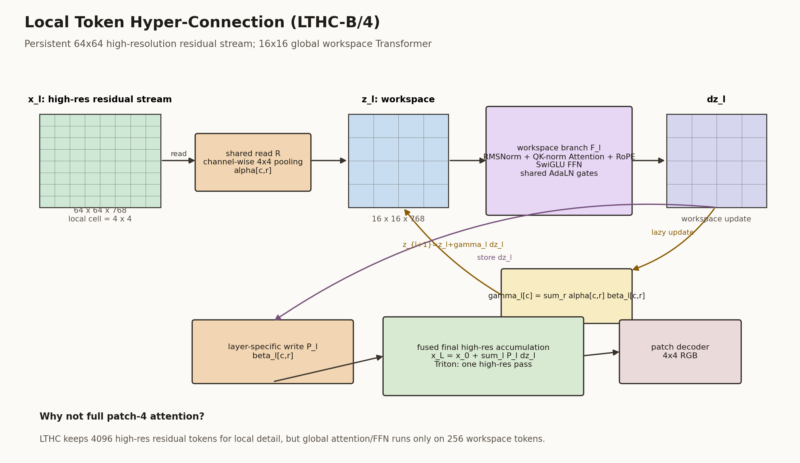

# FlowMatching-LTHC

FlowMatching-LTHC is a flow-matching diffusion backbone built around **Local Token Hyper-Connections**. The model keeps a persistent high-resolution residual state, but performs the expensive global Transformer computation on a compact workspace.

The released checkpoint is a class-conditional ImageNet-256 velocity model. ImageNet is the reference experiment, not a hard assumption of the architecture.



## Core Idea

A patch-4 Transformer on 256x256 images has 4096 image tokens, which makes full attention expensive. A patch-16 model has only 256 tokens, but loses high-resolution residual capacity.

LTHC separates these roles:

```text
high-resolution residual state: 64 x 64 local tokens
low-resolution global workspace: 16 x 16 tokens
```

Each layer reads local high-resolution cells into workspace tokens, applies a standard JiT-style Transformer branch on the workspace, then writes the workspace update back into the high-resolution residual stream.

The workspace branch keeps the usual modern DiT/JiT components:

- RMSNorm and AdaLN gates
- QK RMSNorm attention
- RoPE on the workspace grid
- SwiGLU channel MLP
- class and time conditioning through AdaLN

There are no class/time/register prefix tokens in the released model.

## Architecture

Let $X_l$ be the persistent high-resolution residual state and $Z_l$ be the low-resolution workspace at layer $l$.

A generic LTHC block is:

$Z_l = R_l(X_l)$

$\Delta Z_l = F_l(Z_l, c)$

$X_{l+1} = X_l + P_l(\Delta Z_l)$

Here:

- $R_l$ reads high-resolution residual cells into workspace tokens.
- $F_l$ is the workspace Transformer branch.
- $P_l$ writes workspace updates back to the high-resolution residual stream.
- $c$ is the time-plus-class conditioning vector.

The released model uses a shared read operator, $R_l = R$, and layer-specific write operators, $P_l$. Because $R$ is shared and the local maps are linear, the workspace can be updated exactly without materializing the full high-resolution state after every layer:

$Z_{l+1} = Z_l + \Gamma_l \Delta Z_l$

The final high-resolution state is materialized once before the patch decoder:

$X_L = X_0 + \sum_l P_l(\Delta Z_l)$

This shared-read design is both an architectural choice and a system optimization: it gives a stable workspace coordinate across depth and removes repeated high-resolution memory traffic from the main block loop.

## Released Model

Public alias:

```text
lthc_b4_velocity
```

Current internal name:

```text
local_thc_jit_shared_read_fused_final12_shared_adaln_b4
```

Legacy checkpoint alias, still accepted by `build_model()`:

```text
local_thc_jit_shared_write_fused_final12_shared_adaln_b4
```

The legacy alias came from an early reversed read/write naming convention. In this repository, `read` always means high-resolution residual to workspace, and `write` means workspace update back to the residual stream.

Configuration summary:

| field | value |
|---|---:|
| image size | 256 |
| high-res patch size | 4 |
| high-res grid | 64 x 64 |
| workspace grid | 16 x 16 |
| hidden size | 768 |
| depth | 12 |
| heads | 12 |
| patch embed | Conv patchify 3 -> 128, then 1x1 Conv 128 -> 768 |
| objective | velocity prediction |
| sampler | Heun, 50 steps, CFG |

## Triton Fast Path

The lazy workspace recurrence removes most per-layer high-resolution traffic. The remaining expensive step is final materialization:

$X_L = X_0 + \sum_l P_l(\Delta Z_l)$

A naive PyTorch implementation would create one broadcasted high-resolution update per layer. The released fast path uses a fixed-shape Triton kernel for the B/4, depth-12 case that fuses all 12 write-back operations and the residual add into one high-resolution pass.

See [docs/kernel_note.md](docs/kernel_note.md) and [flowmatching_lthc/models/kernel_note.md](flowmatching_lthc/models/kernel_note.md) for implementation details.

## Reference Results

Reference run:

```text
im256_local_thc_shared_write_fused_final12_b4_velocity_gpus4567_bs128_accum2_20260531_055810
```

The run directory keeps its original legacy name; the architecture is the shared-read model described above.

50k-sample ImageNet validation FID/IS, Heun 50, CFG 2.9:

| step | raw/model FID50k | EMA FID50k | EMA IS |
|---:|---:|---:|---:|
| 200k | 19.87 | not run | not run |
| 250k | 17.32 | 14.30 | 104.57 |
| 300k | 17.10 | 12.52 | 114.42 |
| 350k | not run | 11.31 | 122.80 |
| 400k | not run | 10.63 | 127.59 |

The compact CSV/plot snapshot is stored in `results/lthc_patch4_ema50k/`.

## Installation

```bash
git clone https://github.com/tongtongliang/flowmatching_lthc.git
cd flowmatching_lthc
pip install -e .
```

Core dependencies are listed in `pyproject.toml`. The CUDA fast path expects PyTorch 2.x and Triton.

## Checkpoint

The 400k EMA checkpoint is published as a GitHub Release asset rather than committed to git, because the file is about 1.4GB.

Expected filename:

```text
step_00400000.pt
```

Download:

```bash
mkdir -p checkpoints
wget -O checkpoints/step_00400000.pt \
  https://github.com/tongtongliang/flowmatching_lthc/releases/download/v0.1.0/step_00400000.pt
```

After downloading, set:

```bash
export FLOWMATCHING_LTHC_CKPT=/path/to/step_00400000.pt
```

## Inference

Minimal generation command:

```bash
python scripts/inference.py \
  --checkpoint "$FLOWMATCHING_LTHC_CKPT" \
  --output outputs/lthc_grid.png \
  --class_id 207 \
  --batch_size 16 \
  --steps 50 \
  --cfg 2.9 \
  --compile
```

Multiple classes:

```bash
python scripts/inference.py \
  --checkpoint "$FLOWMATCHING_LTHC_CKPT" \
  --output outputs/lthc_multi_class.png \
  --class_ids 207 281 285 292 \
  --batch_size 16 \
  --steps 50 \
  --cfg 2.9 \
  --compile
```

CPU checkpoint-loading sanity check, intentionally tiny and slow:

```bash
python scripts/inference.py \
  --checkpoint "$FLOWMATCHING_LTHC_CKPT" \
  --output outputs/cpu_sanity.png \
  --device cpu \
  --batch_size 1 \
  --steps 1 \
  --naive
```

The older `scripts/sample_checkpoint.py` entry point is kept for compatibility.

## Training

Example 8-GPU launch:

```bash
DATA_PATH=/path/to/imagenet256 \
RUN_DIR=runs/lthc_b4_velocity \
WANDB_PROJECT=flowmatching-lthc \
WANDB_ENTITY=your-wandb-entity \
bash scripts/launch_lthc_b4_velocity_8gpu.sh
```

Important defaults:

```text
prediction        velocity
optimizer         AdamW, betas=(0.9, 0.95), fused=True
lr                2e-4
warmup_steps      6250
weight_decay      0.0
EMA               0.9999
batch/GPU         128
compile           torch.compile, mode auto
attention         PyTorch SDPA with flash backend preference
```

Equivalent config is stored in `configs/lthc_b4_velocity_imagenet256.json`.

## Evaluation

The evaluation script samples images and computes FID/IS if torch-fidelity and an ImageNet-256 statistics file are available:

```bash
torchrun --nproc_per_node=8 scripts/evaluate_fid.py \
  --checkpoint "$FLOWMATCHING_LTHC_CKPT" \
  --output_dir runs/eval_lthc \
  --state_key ema \
  --model lthc_b4_velocity \
  --prediction velocity \
  --num_samples 50000 \
  --batch_size 256 \
  --steps 50 \
  --cfg 2.9 \
  --interval_min 0.1 \
  --interval_max 1.0 \
  --noise_scale 1.0 \
  --compile \
  --compile_mode default
```

## Repository Layout

```text
flowmatching_lthc/
  flowmatching_lthc/
    models/
      local_thc.py
      local_thc_triton_kernels.py
      jit_shared_adaln.py
    checkpoint.py
    imagenet.py
    sampling.py
    optim/
  imaget_lthc/
    compatibility import wrappers
  scripts/
    inference.py
    train_imagenet256.py
    evaluate_fid.py
    sample_checkpoint.py
    launch_lthc_b4_velocity_8gpu.sh
  configs/
    lthc_b4_velocity_imagenet256.json
  docs/
    model.md
    kernel_note.md
    assets/lthc_architecture.png
```

## Notes

- `flowmatching_lthc` is the canonical package name.
- `imaget_lthc` remains as a backward-compatible import alias.
- No dataset is committed. `DATA_PATH` should point to ImageNet-256 in ImageFolder form or a supported zip layout.
- Add a license before making the repository public.
